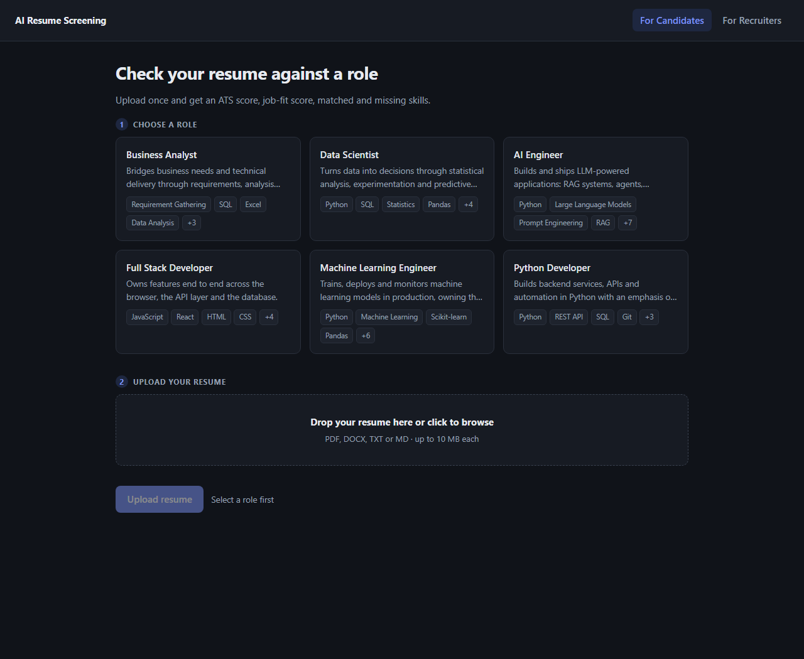
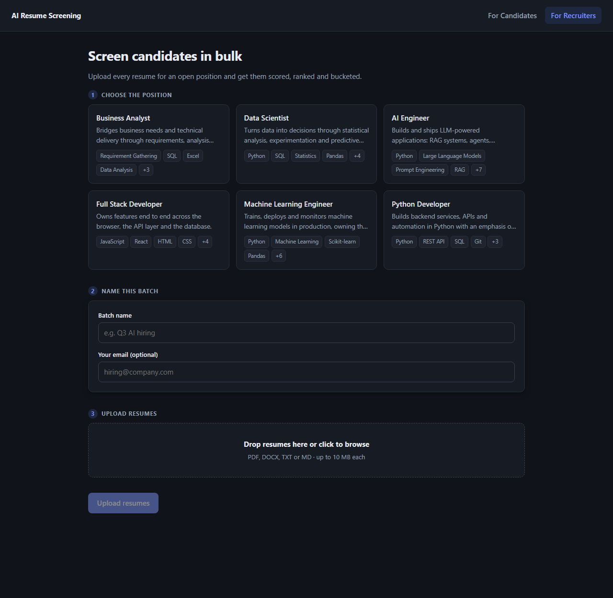

# AI Resume Screening & Intelligent Candidate Shortlisting

An AI-powered platform with two flows:

- **Candidates** pick a target role, upload a resume, and get an ATS score, job-fit
  score, matched/missing skills and concrete suggestions.
- **Recruiters** pick a position, bulk-upload resumes, and get every candidate
  scored, ranked and bucketed into **Strong Match / Consider / Weak Match**, then
  interrogate the results with RAG ("Why was Rahul shortlisted?").

## Stack

| Layer | Choice |
| --- | --- |
| Frontend | React 18 + TypeScript + Vite |
| Backend | FastAPI + SQLAlchemy 2.0 (async) + Pydantic v2 |
| Database | PostgreSQL 16 (`pgvector` image, ready for Day 4) |
| Migrations | Alembic (async env) |
| Vector store | Qdrant (Day 4, `--profile vector`) |
| LLM | Groq (Llama 3.3 70B), forced tool-calling for structured extraction |
| Deployment | Docker + Docker Compose |

---

## Status — Day 3 complete

**Day 1** — foundation: job-role catalogue, database, upload pipeline.

- [x] Project scaffold, settings, structured error handling, logging
- [x] Database schema + async Alembic migrations (5 tables)
- [x] Job-role catalogue with 6 seeded roles and full matching vocabulary
- [x] Resume upload: candidate (single) and recruiter (bulk) flows
- [x] File validation (extension + magic bytes), size limits, SHA-256 de-duplication
- [x] Local storage with date sharding and path-traversal protection
- [x] React frontend for both flows

**Day 2** — resume and job-description parsing.

- [x] Local text extraction: PDF (`pypdf`), DOCX (`python-docx`), TXT/MD
- [x] LLM structured extraction via Groq, forced tool-calling against a Pydantic
      JSON schema (nested objects via `$defs` — no plain "JSON mode" guessing)
- [x] Provider-agnostic `LLMProvider` interface — swapping Groq for another
      provider later touches one factory function, not every call site
- [x] Parsing orchestration: text extraction always runs; the LLM step is queued
      as a `BackgroundTask` so uploads return immediately
- [x] Candidate creation/linking from parsed contact info, refreshed on re-parse
- [x] Job-description endpoints: create from pasted text or an uploaded file,
      list, get, manual re-parse
- [x] Manual re-parse endpoints for both resumes and job descriptions
- [x] Recruiter UI step to attach a job description (paste or upload) to a batch

**Day 3** — ATS scoring.

- [x] `resume_scores` table, one row per resume, refreshed on re-score — built
      wide enough up front (`semantic_score`, `final_score`, `category` columns
      already present but null) that Days 4-5 add logic, not migrations
- [x] ATS keyword coverage: literal, case-insensitive scan of a role's
      `ats_keywords` against the resume's extracted raw text
- [x] Required-skill match: parsed resume skills vs. a role's required/preferred
      skills, producing a percentage plus matched/missing skill lists
- [x] Experience fit: candidate's parsed years vs. a role's min/max, with an
      unstated year treated as neutral (50%) rather than a penalty
- [x] If a batch is linked to a specific job description (see Day 2's UI
      addition), its parsed required/preferred skills are merged into the
      scoring vocabulary automatically
- [x] Rule-based improvement suggestions (missing skills, thin ATS coverage, no
      stated experience/education) — no LLM call, this is pure computation
- [x] Scoring runs automatically as soon as parsing succeeds, and manually via
      `POST /resumes/{id}/score`
- [x] All 6 seeded roles' `min_experience_years` set to 0 — nobody is filtered
      out purely for being junior; experience only affects the score

**Verified end to end against the real Groq API and Postgres**: uploaded a real
resume, watched it parse then auto-score, and inspected the exact matched/missing
skills and suggestions. Along the way this surfaced a genuine bug — see "Design
notes" — that's now fixed and covered by a regression test.

| Candidate flow | Recruiter flow |
| --- | --- |
|  |  |

### Roadmap

| Day | Scope |
| --- | --- |
| 1 | Foundation, job roles, database, APIs, resume uploads ✅ |
| 2 | Resume + job-description parsing (PDF/DOCX text, LLM structured extraction) ✅ |
| 3 | ATS scoring ✅ |
| 4 | Semantic matching (BGE/E5 embeddings) + skill matching |
| 5 | Candidate ranking and shortlist categories |
| 6 | RAG, LLM explanations, recruiter AI chat |
| 7 | Evaluation benchmark, Dockerisation, docs, deployment |

---

## Quick start

### Prerequisites

Docker Desktop, Python 3.12+, Node 20+.

### 1. Environment

```bash
cp .env.example .env
```

> **Port note.** The Postgres container publishes on host port **5433**, not 5432, so
> it never collides with a locally installed Postgres. Change `POSTGRES_PORT` in
> `.env` if you prefer another port.

> **LLM parsing (optional but recommended).** Get a free key at
> [console.groq.com](https://console.groq.com) → API Keys, then set
> `GROQ_API_KEY` in `.env`. Without it, uploads still work — text extraction and
> storage happen normally — but the structured-extraction step is skipped
> rather than failed, and `parse_status` stays `pending`.

### 2. Database

```bash
docker compose up -d postgres
```

### 3. Backend

```bash
cd backend
python -m venv .venv
.venv\Scripts\activate            # Windows
# source .venv/bin/activate       # macOS / Linux

pip install -r requirements.txt
alembic upgrade head              # create the schema
uvicorn app.main:app --reload --host 127.0.0.1 --port 8000
```

The six system job roles are seeded automatically on startup (idempotent — edit
`app/data/job_roles_seed.json` and restart to update them).

- API docs: <http://localhost:8000/docs>
- Liveness: <http://localhost:8000/health>
- Readiness (checks the DB): <http://localhost:8000/health/ready>

### 4. Frontend

```bash
cd frontend
npm install
npm run dev
```

Open <http://localhost:5173>. Vite proxies `/api` to the backend, so there is no
CORS setup in development.

### 5. Sample resumes (optional)

```bash
cd backend
python scripts/make_sample_resumes.py     # writes backend/sample_data/
```

Produces four realistic resumes as plain text, one as DOCX, one as a genuinely
valid hand-rolled PDF, and one file whose extension lies about its contents —
handy for exercising both the parsing path and the rejection path.

### Run everything in Docker

```bash
docker compose --profile full up -d --build
```

---

## Testing

```bash
cd backend
pytest -q
```

Tests run against a real Postgres so JSONB, UUID and constraint behaviour matches
production. A `resume_screening_test` database is created and dropped per run;
your dev data is never touched.

```
150 passed
```

Coverage: filename sanitisation, magic-byte sniffing, size limits, storage
round-trips and traversal guards, job-role CRUD, candidate upload + de-duplication,
recruiter bulk upload (partial-failure reporting), batch lifecycle, health probes,
text extraction (PDF/DOCX/TXT/MD, including a genuinely valid hand-rolled PDF
fixture), parsing orchestration (success/failure paths, candidate linking,
re-parse idempotency), job-description creation and parsing, ATS/skill/experience
scoring math (parametrised against known inputs), JD-vocabulary merging, and a
schema-level regression test locking in the null-list Groq fix described below.

No test ever calls the real Groq API — a `FakeLLMProvider` fixture stands in for
it, so the suite runs offline and free. See "Design notes" below for how.

---

## API

Base path: `/api/v1`

### Job roles

| Method | Path | Purpose |
| --- | --- | --- |
| `GET` | `/job-roles` | List roles (`limit`, `offset`, `category`, `search`, `include_inactive`) |
| `GET` | `/job-roles/{slug\|id}` | Full role detail, including skills and scoring weights |
| `POST` | `/job-roles` | Create a custom role (slug generated from the title) |

### Candidate flow

| Method | Path | Purpose |
| --- | --- | --- |
| `POST` | `/resumes` | Upload one resume (`job_role_id` + `file`, multipart) — queues parsing |
| `GET` | `/resumes` | List/filter by role, batch, source, parse status |
| `GET` | `/resumes/{id}` | Resume record, including `parsed_data` and `score` once ready |
| `GET` | `/resumes/{id}/download` | Original file |
| `POST` | `/resumes/{id}/parse` | Re-run text extraction + structured parsing |
| `POST` | `/resumes/{id}/score` | Re-run ATS scoring (synchronous — no LLM call to wait on) |
| `DELETE` | `/resumes/{id}` | Delete the record and its stored file |

Scoring runs automatically right after a successful parse, so in the normal
flow you never need to call `/score` yourself — it exists for recomputing
after, say, editing a role's required skills.

### Recruiter flow

| Method | Path | Purpose |
| --- | --- | --- |
| `POST` | `/batches` | Create a screening batch for a role (optionally linked to a JD) |
| `GET` | `/batches` | List batches (filter by role or status) |
| `GET` | `/batches/{id}` | Batch with its resumes (each including its score) and role |
| `POST` | `/batches/{id}/resumes` | Bulk-upload (multipart `files`, up to 50) — queues parsing + scoring for each |
| `DELETE` | `/batches/{id}` | Delete the batch and everything in it |

### Job descriptions

| Method | Path | Purpose |
| --- | --- | --- |
| `POST` | `/job-descriptions` | Create from pasted text **or** an uploaded file (exactly one) |
| `GET` | `/job-descriptions` | List/filter by role or parse status |
| `GET` | `/job-descriptions/{id}` | Detail, including `raw_text` and `parsed_data` |
| `POST` | `/job-descriptions/{id}/parse` | Re-run structured extraction |

Job-description files aren't kept — only the text extracted from them — so
there's no matching `/download` route.

### Scoring

Every parsed resume carries a `score` object once scoring completes:

```json
{
  "ats_score": 25.0,
  "matched_ats_keywords": ["LLM", "transformer", "inference", "evaluation"],
  "required_skill_match": 72.7,
  "matched_skills": ["Python", "RAG", "LangChain", "FastAPI", "Docker", "…"],
  "missing_skills": ["Vector Databases", "REST API", "Git"],
  "experience_match": 100.0,
  "candidate_experience_years": 4.0,
  "suggestions": [
    "Add these required skills if you have them: Vector Databases, REST API, Git.",
    "Your resume is missing common role keywords like: GPT, Claude, retrieval augmented generation."
  ],
  "semantic_score": null,
  "final_score": null,
  "category": null
}
```

`semantic_score`, `final_score` and `category` are reserved for Days 4-5 and
stay `null` until then. That real example is a genuine limitation worth
noting: the candidate's resume lists FAISS, Qdrant and Pinecone but not the
literal phrase "Vector Databases", so `ats_score`/`missing_skills` penalise it
even though the candidate clearly has the underlying skill — exactly the gap
Day 4's semantic matching exists to close.

### Error format

Every failure returns the same envelope:

```json
{
  "error": {
    "code": "unsupported_file_type",
    "message": "'cv.pdf' does not appear to be a valid .pdf file.",
    "details": { "declared_extension": ".pdf" }
  }
}
```

Codes: `not_found` (404), `validation_error` / `request_validation_error` (422),
`unsupported_file_type` (415), `file_too_large` (413), `duplicate_resource` (409),
`internal_error` (500).

### Bulk upload is partially fault-tolerant

One malformed CV must not cost a recruiter the other 49. Each file is validated
independently and reported per row:

```json
{
  "received": 6, "uploaded": 4, "duplicates": 1, "rejected": 1,
  "items": [
    { "filename": "rahul.txt", "status": "uploaded",  "resume_id": "…" },
    { "filename": "rahul.txt", "status": "duplicate", "resume_id": "…" },
    { "filename": "fake.pdf",  "status": "rejected",
      "error_code": "unsupported_file_type", "error": "…" }
  ]
}
```

---

## Design notes

**De-duplication is scoped, not global.** Files are fingerprinted with SHA-256.
For recruiter uploads the scope is the batch; for candidate uploads it is the job
role — so the same CV submitted against a *different* role is a legitimately new
record, not a duplicate. A `UNIQUE (batch_id, content_hash)` constraint backs this
at the database level.

**Declared content types are not trusted.** A browser's `Content-Type` is advisory,
so every upload is checked against its magic bytes (`%PDF-` for PDF, the ZIP header
for DOCX, decodability for text). `fake.pdf` containing plain text is rejected.

**Skills live in JSONB, not a join table.** The matcher reads a role's vocabulary as
one document and never queries it field-by-field, so a join table would add cost
without buying anything.

**Storage is behind an interface.** `LocalResumeStorage` shards by `YYYY/MM`,
resolves every path against the storage root (rejecting traversal), and can be
swapped for S3/GCS without touching the API layer.

**Scoring weights ship with each role.** Each role carries its own
`scoring_weights` (`ats`, `required_skills`, `semantic`, `experience`) summing to
1.0 — a Business Analyst weights ATS keywords more heavily than an AI Engineer,
whose semantic fit matters more. A test enforces the normalisation.

**Parsing is forced tool-calling, not "JSON mode."** `ParsedResumeData` and
`ParsedJobDescriptionData` (in `app/schemas/`) are plain Pydantic models.
`model_json_schema()` on each becomes a Groq tool definition, and `tool_choice`
is forced to that exact tool — the model has no path to return prose instead of
structured data, and nested objects (experience entries, education entries) come
back correctly via `$defs` without any manual JSON-schema wrangling. The same
class then validates the response before it's persisted.

**The LLM sits behind an interface, like storage does.** `app/services/llm/`
defines `LLMProvider` (one method: text + a schema in, a validated model out)
and `get_llm_provider()` as the only way callers obtain one. `GroqProvider` is
the only implementation today; adding Ollama or Gemini later is a new class and
a one-line change to the factory, not a rewrite of the parsing service.

**Parsing runs as a `BackgroundTask`, not inline.** Uploading a resume returns
immediately with `parse_status: "pending"`; the LLM call happens after the
response is sent. `parse_resume`/`parse_job_description` open their own database
session rather than reusing the request's, since by the time a background task
runs, the request that queued it has already closed its own session. Bulk
uploads queue one task per successfully-ingested file — a rejected or duplicate
file is never queued.

**Tests never touch the real Groq API.** A `FakeLLMProvider` fixture
(`tests/conftest.py`) replaces `get_llm_provider()` for every test that goes
through the API layer, returning an empty-but-valid model by default or
whatever a test sets on `.response`/`.error`. This is also what makes the suite
safe to run without a `GROQ_API_KEY` at all.

**Scoring is pure computation, deliberately.** `scoring_service.py` makes zero
network calls — no LLM, no embeddings. Day 3's job is the classic ATS behaviour
(literal keyword scanning, exact-ish skill-list overlap), which is fast,
free, and fully deterministic; that's also why it's tested with plain
parametrised unit tests rather than a `FakeLLMProvider`. Day 4 adds the
semantic layer *on top* of this, not instead of it — a resume can score low on
Day 3's literal match and still recover on Day 4's semantic similarity.

**A linked job description extends the vocabulary, it doesn't replace it.**
When a recruiter attaches a specific JD to a batch, its parsed
`required_skills`/`preferred_skills` are merged into the role's own lists
(deduplicated) before scoring — a candidate is measured against the role's
general expectations *and* whatever this particular posting adds, not just one
or the other.

**The `resume_scores` table was designed for Days 3-5 up front.** `semantic_score`,
`final_score` and `category` exist as nullable columns already, populated by
nothing yet. This mirrors the same choice made for `Resume.parsed_data` back on
Day 1: define the shape once, let later days fill it in, and avoid three more
migrations for what is conceptually one entity (a resume's score against a role).

**A real bug, caught by testing against the live API, not just mocks.** Every
list field in `ParsedResumeData`/`ParsedJobDescriptionData` was originally typed
as plain `list[str]` with a default of `[]`. Groq's structured-output validation
is strict against the JSON schema it's given — when the model emitted `null`
for an empty `education` list instead of `[]`, Groq itself rejected the tool
call with a 400 *before* the response ever reached our code:
`` `/education`: expected array, but got null ``. Every list field's type is
now `list[T] | None` (so the schema handed to Groq permits null) with a
`field_validator(mode="before")` that normalises `None` back to `[]`, so nothing
downstream has to special-case it. `tests/test_parsed_data_schemas.py` asserts
every list field's generated schema permits null and that null validates to
`[]`, so this can't silently regress. This is exactly why the "verify against
the real API" step earlier in this session mattered — the mocked test suite
was green throughout; only a live call surfaced it.

---

## Project layout

```
.
├── docker-compose.yml
├── .env.example
├── backend/
│   ├── alembic/               # async migration env + versions
│   ├── scripts/               # sample-resume generator (incl. a hand-rolled valid PDF)
│   ├── tests/                 # 150 tests against a real Postgres
│   └── app/
│       ├── api/v1/endpoints/  # health, job_roles, resumes, batches, job_descriptions
│       ├── core/              # settings, logging, error handling
│       ├── data/              # job_roles_seed.json
│       ├── db/                # base, session, seeder
│       ├── models/            # SQLAlchemy models + enums (incl. resume_score.py)
│       ├── schemas/           # Pydantic request/response + parsed-data models
│       └── services/
│           ├── llm/                 # LLMProvider interface, GroqProvider, factory
│           ├── text_extraction.py
│           ├── parsing_service.py   # orchestrates extraction -> LLM -> persist -> score
│           ├── scoring_service.py   # ATS keyword coverage, skill match, experience fit
│           ├── file_validation.py
│           ├── storage.py
│           └── resume_service.py
└── frontend/
    └── src/
        ├── api/               # typed client + shared types
        ├── components/        # RolePicker, FileDropzone
        └── pages/             # Home, Candidate, Recruiter
```

## Data model

| Table | Role |
| --- | --- |
| `job_roles` | Catalogue of screenable positions, skills, ATS keywords, weights |
| `job_descriptions` | Recruiter-supplied JDs — `raw_text` + `parsed_data`, populated on creation |
| `candidates` | People — created/refreshed by resume parsing |
| `resumes` | Uploaded files — `raw_text` + `parsed_data` populated by parsing |
| `resume_scores` | One row per resume — ATS/skill/experience scores (Day 3), semantic + final score (Days 4-5, null for now) |
| `screening_batches` | A recruiter's bulk run; groups resumes for ranking |

Columns and tables for Days 4-5 (`semantic_score`, `final_score`, `category` on
`resume_scores`) already exist as nullable, so those days add logic rather than
destructive migrations.

## Troubleshooting

**`password authentication failed for user "resume"`** — a local Postgres is
occupying port 5432 and shadowing the container. The compose file publishes 5433
for exactly this reason; make sure `POSTGRES_PORT=5433` in `.env`.

**`ECONNREFUSED ::1:8000` from the Vite proxy** — Node resolves `localhost` to IPv6
first and uvicorn binds IPv4. The proxy target is pinned to `127.0.0.1`; if you
changed it, change it back.

**Job roles are empty** — run `alembic upgrade head`, then restart the API (seeding
runs on startup) or run `python -m app.db.seed`.

**A resume stays `pending` forever** — either `GROQ_API_KEY` isn't set (parsing is
silently skipped, not failed — see the note under Quick Start), or the Groq
free-tier rate limit was hit. Check `parse_error` on the resume once it's
`failed`, or re-trigger with `POST /resumes/{id}/parse`.

**`parse_error` mentions "tool call validation failed" / "expected array, but
got null"** — a new field was added to `ParsedResumeData` or
`ParsedJobDescriptionData` typed as a plain `list[...]` rather than
`list[...] | None`. Groq's own schema validation rejects a `null` response
against a schema that only allows an array. Type it as `list[T] | None` and add
it to that model's `_null_list_becomes_empty` validator — see "Design notes."

**Tests hang or fail at teardown with "Event loop is closed" (Windows only)** —
a known bad interaction between Windows' default `ProactorEventLoop` and
`asyncpg` when a fixture hands out a live DB connection the test body uses and
then touches again during its own teardown. `tests/conftest.py` works around it
by forcing the `SelectorEventLoop` policy and pinning `loop_scope="function"` on
any fixture that yields a live session (`test_engine`, `session`, `parsing_env`,
`client`). If you add a new fixture in that shape, give it the same treatment.
